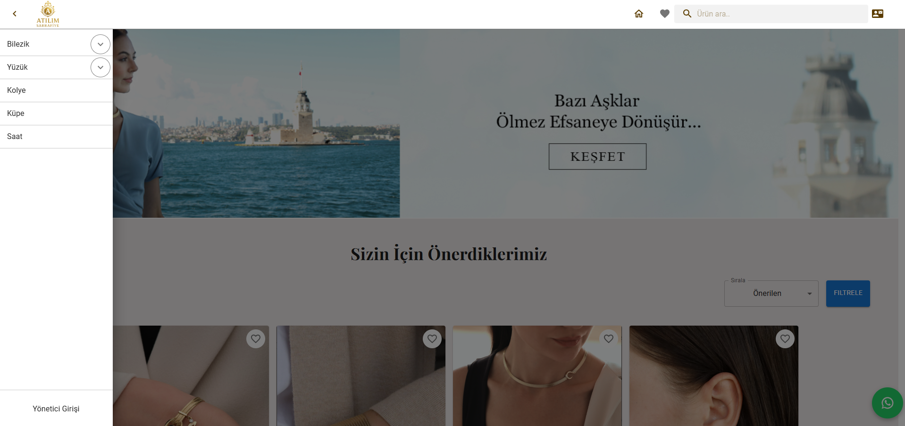
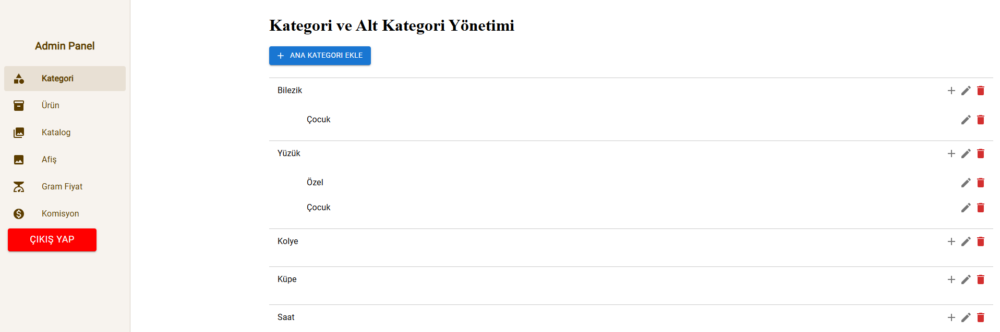

# 🚀 Atılım

**Atılım**, React ve Vite kullanılarak geliştirilmiş, hem kullanıcıya açık bir vitrin (frontend) hem de kapsamlı bir **admin paneli** içeren modern bir kuyumcu web sitesi uygulamasıdır.  
Proje; ürün yönetimi, fiyatlandırma ayarları ve kullanıcı etkileşimlerini tek bir sistem altında toplamayı hedefler.

---

## 🌐 Canlı Site

🔗 **Canlı Demo:** [atilim.vercel.app](https://atilim.vercel.app/)

---

## 🧠 Proje Hakkında

Atılım projesi, ürünlerin sergilendiği bir **ana sayfa** ve tüm içeriklerin yönetildiği bir **admin paneli** olmak üzere iki ana yapıdan oluşur.

- Kullanıcı tarafında ürünler listelenir, aranır, filtrelenir ve favorilere eklenir.
- Yönetici tarafında ise kategori, ürün, katalog ve afiş yönetimi yapılır.
- Ayrıca sistem genelinde fiyatlandırmayı etkileyen **gram fiyatı** ve **banka komisyon oranları** dinamik olarak güncellenebilir.

Bu yapı sayesinde site içerikleri ve fiyatlandırmalar kod değişikliğine gerek kalmadan yönetilebilir.

---

## 🖼️ Ekran Görüntüleri

### 🏠 Ana Sayfa

Kullanıcıların siteye girdiğinde karşılaştığı ana vitrin ekranı.

---

### 🔐 Admin Paneli

Tüm yönetim işlemlerinin yapıldığı admin ekranı.

---

## ✨ Ana Sayfa (Kullanıcı) Özellikleri

### 🛍️ Ürün Listeleme
- Ürünler kategori bazlı listelenir
- Dinamik ürün kartları
- Güncel fiyat bilgileri

### ❤️ Favorilere Alma
- Kullanıcılar beğendikleri ürünleri favorilerine ekleyebilir
- Favoriler listesi üzerinden hızlı erişim
- Kullanıcı deneyimini artıran etkileşimli yapı

### 🔍 Ürün Arama
- Ürün adına göre anlık arama
- Büyük ürün listelerinde hızlı erişim
- Kullanıcı dostu arama alanı

### 🔃 Sıralama
- Fiyata göre sıralama (artan / azalan)
- İsme göre sıralama
- Güncel listeleme seçenekleri

### 🧰 Filtreleme
- Kategoriye göre filtreleme
- Fiyat aralığına göre filtreleme
- Birden fazla filtreyi aynı anda kullanabilme

### Ürün İçeriğine Gitme
- Ürünün üzerine tıklayarak detay sayfasına gitme
- Ürünün fiyat, ayar gibi bütün detaylarını görme

---

## 🔐 Admin Paneli Özellikleri

### 📂 Kategori Yönetimi
- Yeni kategori ekleme
- Mevcut kategorileri güncelleme
- Kategori silme
- Kategoriye bağlı ürün kontrolü

### 📦 Ürün Yönetimi
- Ürün ekleme
- Ürün bilgilerini güncelleme
- Ürün silme
- Ürün fiyat ve detay kontrolü

### 📚 Katalog Yönetimi
- Katalog ekleme
- Katalog güncelleme
- Katalog silme
- Ürünleri kataloglara dahil etme

### 🖼️ Afiş (Banner) Yönetimi
- Ana sayfada gösterilecek afişleri ekleme
- Afiş güncelleme
- Afiş kaldırma
- Kampanya ve duyuru yönetimi

### ⚖️ Gram Fiyatı Ayarları
- Sistem genelinde kullanılan **gram fiyatını** güncelleme
- Fiyat değişikliğinin tüm ürünlere otomatik yansıması
- Merkezi fiyat kontrolü

### 🏦 Banka Komisyon Oranları
- Bankalara göre komisyon oranı tanımlama
- Komisyon oranlarını güncelleme
- Ödeme hesaplamalarında dinamik kullanım

---
